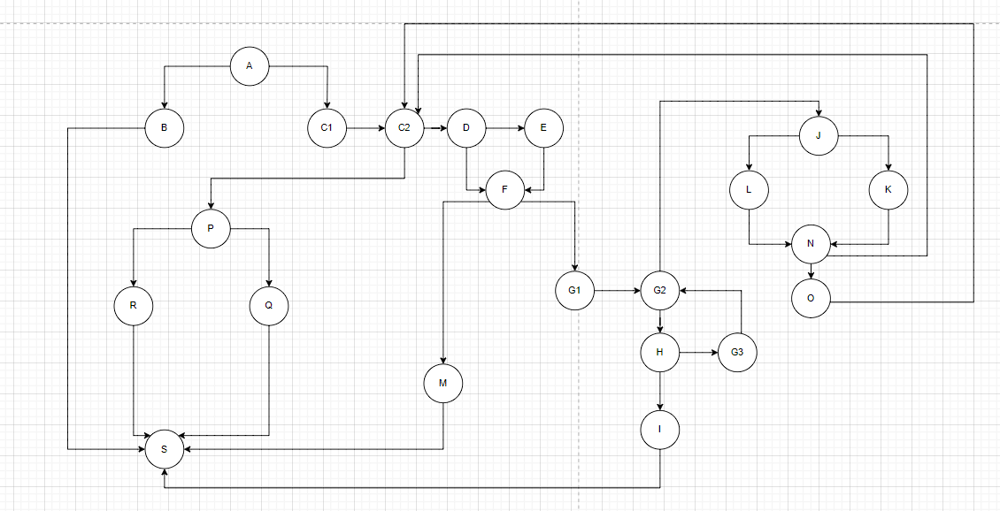
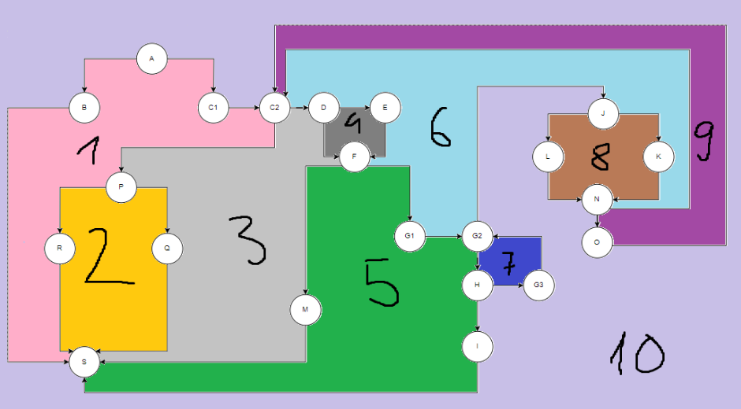

Андреј Тасковски, 211210

Control Flow Graph

Цикломатска комплексност
Цикломатската комплексност ја пресметав преку формулата C = E - N + 2, каде Е=30, N=22, па се добива 8+2=10. Истото се добива и ако ги изброиме регионите од CFG.

Тестови според Every Branch критериумот

- тест 1: List<Item> list = {item1, item2, item3}, payment = 50, каде
    Item item1 = new Item("testname1", "12345", 20, 10);
    Item item2 = new Item("testname2", "54321", 60, 20);
    Item item3 = new Item("testname3", "17542", 40, 30);
рендом одбран тест, чисто за да видам кои гранки ќе останат неизминати;

- тест 2: List<Item> list = {new Item(null, null, 300, -10)}, payment = 5000, заради изминување на гранките D-E, E-F, F-M, M-S, односно кога името е null и баркодот е null, при што се фрла исклучок;

- тест3: List<Item> list = {new Item("item", "01234", 400, 10)}, payment = 5000, заради изминување на гранките N-O, O-C2, P-Q, Q-S, односно исполнување на условите (item.getPrice() > 300 && item.getDiscount() > 0 && item.getBarcode().charAt(0) == '0'), и потоа (sum <= payment);

- тест 4: кога листата е null, а вредноста на payment може да биде било која, бидејќи овој тест е за гранките A-B и B-S, каде се фрла исклучок ако листата е еднаква на null;

- тест 5: List<Item> list = {new Item("item", "01234", 400, -10)}, payment = 5000, за гранките J-L, L-N, кога имаме негативен discount;

- тест 6: List<Item> list = {new Item("item", "!1234", 400, -10)}, payment = 5000, за исклучокот кога имаме недозволен карактер во баркодот.